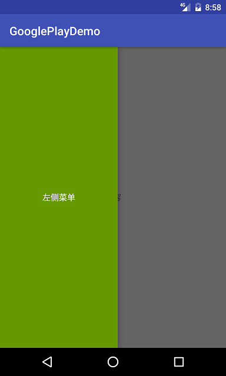
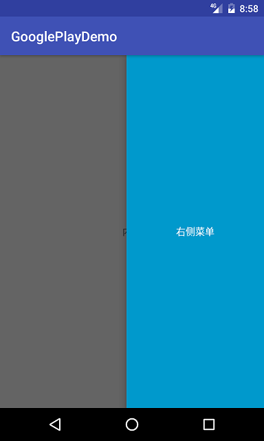
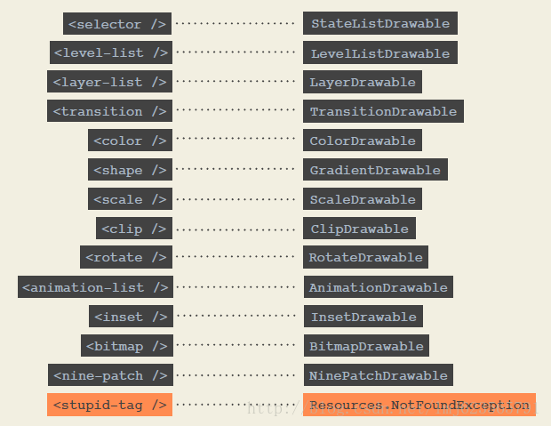
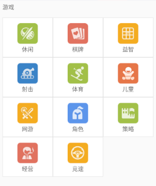

# 项目简介 #
本项目是应用市场的一个示例项目，展示了一个应用市场基本的功能：应用展示，应用分类，应用详情，应用下载等。

# 学习目标 #
* 自上而下的代码抽取
* 网络框架Retrofit使用
* 多线程下载

# 服务器搭建 #
* 文件说明
	* GooglePlayServer:java ee工程,我们的服务器
	* GooglePlayServer.war:java ee工程的war包形式
	* WebInfos:资源文件
	* GooglePlayServerAndroid:手机端的服务器,可以运行servlet

* 搭建方式:
	* war包方式:
		1. 把war放到tomact的webapps目录下面就可以,然后启动tomcat会自动解压war包.
		2. 启动tomcat,自动解压war包,并运行程序 
		3. 修改`webapps\GooglePlayServer\WEB-INF\classes`目录下system.properties为`dir=C:\\Users\\Leon\\Desktop\\GooglePlay\\server`(`WebInfos`所在的目录),需要注意要么用"/"或者"\\"
		4. 在pc和手机上分别验证 
		5. `注意:tomcat必须使用7以上版本`

	* 源码形式.
		1. 用java ee 版eclipse导入工程GooglePlayServer.
		2. 修改`webapps\GooglePlayServer\WEB-INF\classes`目录下system.properties为`dir=C:\\Users\\Leon\\Desktop\\GooglePlay\\server`(`WebInfos`所在的目录),需要注意要么用"/"或者"\\"
		3. 部署java ee工程到tomcat,然后运行
		4. 在pc和手机上分别验证。

# 项目初始化 #
* BaseActivity
* ButterKnife集成
* Git初始化

# 侧滑菜单 #

## 布局 ##

	<?xml version="1.0" encoding="utf-8"?>
	<android.support.v4.widget.DrawerLayout
	    android:id="@+id/drawer_layout"
	    xmlns:android="http://schemas.android.com/apk/res/android"
	    android:layout_width="match_parent"
	    android:layout_height="match_parent"
	    android:fitsSystemWindows="true"
	    xmlns:app="http://schemas.android.com/apk/res-auto">
	
	    <!-- Content -->
	    <include layout="@layout/main_content"/>
	    <!-- Drawer -->
	    <android.support.design.widget.NavigationView
	        android:id="@+id/navigation"
	        android:layout_width="wrap_content"
	        android:layout_height="match_parent"
	        android:layout_gravity="start"
	        app:headerLayout="@layout/drawer_header"
	        app:menu="@menu/drawer_main"/>
	
	</android.support.v4.widget.DrawerLayout>

## DrawLayout ##
在DrawerLayout出现之前，我们需要做侧滑菜单时，不得不自己实现一个或者使用Github上的开源的项目SlidingMenu，也许是Google也看到了SlidingMenu的强大之处，于是在Android的后期版本中添加了DrawerLayout来实现SlidingMenu同样功能的组件，而且为了兼容早期版本，将其添加在android,support.v4包下。

  

### 布局 ###
	<?xml version="1.0" encoding="utf-8"?>
	<android.support.v4.widget.DrawerLayout
	    android:id="@+id/drawer_layout"
	    xmlns:android="http://schemas.android.com/apk/res/android"
	    android:layout_width="match_parent"
	    android:layout_height="match_parent">
	
	    <TextView
	        android:id="@+id/content"
	        android:layout_width="match_parent"
	        android:layout_height="match_parent"
	        android:gravity="center"
	        android:text="内容"/>
	
	    <TextView
	        android:id="@+id/left"
	        android:layout_width="200dp"
	        android:layout_height="match_parent"
	        android:layout_gravity="start"
	        android:textColor="@android:color/white"
	        android:text="左侧菜单"
	        android:gravity="center"
	        android:background="@android:color/holo_green_dark"/>
	
	    <TextView
	        android:id="@+id/right"
	        android:layout_width="200dp"
	        android:layout_height="match_parent"
	        android:layout_gravity="end"
	        android:text="右侧菜单"
	        android:gravity="center"
	        android:textColor="@android:color/white"
	        android:background="@android:color/holo_blue_dark"/>
	
	</android.support.v4.widget.DrawerLayout>

>使用layout_gravity属性来控制是左侧还是右侧菜单

## NavigationView ##
DrawerLayout里面的菜单布局我们可以自己定义，但谷歌也提供的相应的控件NavigationView，方便开发者完成菜单布局。
>app:headerLayout="@layout/drawer_header" 定义菜单的头布局
>
>app:menu="@menu/drawer_main" 定义菜单选项

### 设置菜单点击监听 ###
    mNavigationView.setNavigationItemSelectedListener(new NavigationView.OnNavigationItemSelectedListener() {
        @Override
        public boolean onNavigationItemSelected(@NonNull MenuItem item) {
            mDrawerLayout.closeDrawer(GravityCompat.START);
            mNavigationView.setCheckedItem(item.getItemId());
            return false;
        }
    });

## ActionBar ##
### 介绍
* Action Bar 是Google 在Android 3.0之后推出的一种全新用户操作方式
* 目的是用来替换掉菜单按键功能，长按操作功能，提供一种全新的操作体验
* 统一界面，方便开发

### ActionBar 4大部分

1. **app 图标**：包含了 图标，主标题，副标题，回退部分
2. **视图控件**：允许用户切换视图。视图切换控件的样式有`下拉菜单`或`选项卡`控件,d对应了,`标准`，`list`，`tab`,3种导航模式
3. **操作按钮**：在操作栏里，展示出你的 app 中最重要的操作。不能展示在操作栏里的操作，可以自动移到“更多操作”里
4. **更多操作**：把不常用的操作放到更多操作里

### 如何支持actionbar?
1. android sdk 3.0之后默认支持actionBar
2. 市面上也有开源的actionbarSherlock可以支持ActionBar
3. google 2013 i/o大会.在v7(api level 7_android2.1以上)中对actionbar进行了兼容;

### ActionBar基本使用
	// 获取ActionBar
	mActionBar = getSupportActionBar();
	mActionBar.setTitle("MainTitle");// 设置主title部分
	mActionBar.setSubtitle("SubTitle");// 设置子title部分
	mActionBar.setIcon(R.drawable.ic_launcher);// 设置应用图标
	mActionBar.setLogo(R.drawable.ic_launcher);// 设置Logo
	mActionBar.setDisplayShowTitleEnabled(true);// 设置菜单 标题是否可见
	mActionBar.setDisplayShowHomeEnabled(true);// 设置应用图标是否可见
	mActionBar.setDisplayUseLogoEnabled(false);// 设置是否显示Logo优先
	mActionBar.setDisplayHomeAsUpEnabled(true);// 设置back按钮是否可见

### ActionBar和DrawerLayout联动
    private void initActionBar() {
        ActionBar supportActionBar = getSupportActionBar();
        //显示返回按钮
        supportActionBar.setDisplayHomeAsUpEnabled(true);
        //创建ActionBarDrawerToggle
        mActionBarDrawerToggle = new ActionBarDrawerToggle(this, mDrawerLayout, R.string.open, R.string.close);
        //同步DrawerLayout的开关状态
        mActionBarDrawerToggle.syncState();
        //监听DrawerLayout的开关状态, 触发动画
        mDrawerLayout.addDrawerListener(mActionBarDrawerToggle);
    }

    /**
     * 处理ActionBarDrawerToggle的点击事件
     */
    @Override
    public boolean onOptionsItemSelected(MenuItem item) {
        switch (item.getItemId()) {
            case android.R.id.home:
                mActionBarDrawerToggle.onOptionsItemSelected(item);
                break;
        }
        return super.onOptionsItemSelected(item);
    }

## ToolBar ##
官方在某些程度上认为 ActionBar 限制了 android app 的开发与设计的弹性,
Toolbar 是在 Android 5.0 开始推出的一个 Material Design 风格的导航控件 ，Google 非常推荐大家使用 Toolbar 
来作为Android客户端的导航栏，以此来取代之前的 Actionbar 。与 Actionbar 相比，Toolbar 明显要灵活的多。它不像 
Actionbar一样，一定要固定在Activity的顶部，而是可以放到界面的任意位置。

### Toolbar使用 ###
#### 1. 将主题改为NoActionBar ####

	

#### 3. 配置状态栏颜色与Toolbar背景色一致 ####
    <item name="colorPrimaryDark">@color/colorPrimary</item>

# 主界面 #
## 布局 ##
	<!--main_content.xml-->
	<?xml version="1.0" encoding="utf-8"?>
	<LinearLayout
	    xmlns:android="http://schemas.android.com/apk/res/android"
	    xmlns:app="http://schemas.android.com/apk/res-auto"
	    android:layout_width="match_parent"
	    android:layout_height="match_parent"
	    android:orientation="vertical">
	
	    <android.support.v7.widget.Toolbar
	        android:id="@+id/tool_bar"
	        android:layout_width="match_parent"
	        android:layout_height="?attr/actionBarSize"
	        android:background="@color/colorPrimary"
	        app:theme="@style/ThemeOverlay.AppCompat.Dark.ActionBar">
	    </android.support.v7.widget.Toolbar>
	
	    <android.support.design.widget.TabLayout
	        android:id="@+id/tab_layout"
	        android:layout_width="match_parent"
	        android:layout_height="48dip"
	        app:tabBackground="@color/colorPrimary"
	        app:tabIndicatorColor="@color/colorAccent"
	        app:tabIndicatorHeight="3dp"
	        app:tabMode="scrollable"
	        app:tabSelectedTextColor="@android:color/white"
	        app:tabTextColor="@android:color/darker_gray"/>
	
	    <android.support.v4.view.ViewPager
	        android:id="@+id/vp"
	        android:layout_width="match_parent"
	        android:layout_height="match_parent">
	    </android.support.v4.view.ViewPager>
	
	</LinearLayout>

## 初始化布局 ##
    private void initView() {
        mVp.setAdapter(new MainPagerAdapter(getResources().getStringArray(R.array.main_titles), getSupportFragmentManager()));
        mTabLayout.setupWithViewPager(mVp);
    }

	public class MainPagerAdapter extends FragmentPagerAdapter {
	
	    private String[] mTitles;
	
	    private static final int FRAGMENT_HOME = 0;
	    private static final int FRAGMENT_APP = 1;
	    private static final int FRAGMENT_GAME = 2;
	    private static final int FRAGMENT_SUBJECT = 3;
	    private static final int FRAGMENT_RECOMMEND = 4;
	    private static final int FRAGMENT_CATEGORY = 5;
	    private static final int FRAGMENT_LEADER_BOARD = 6;
	
	
	    public MainPagerAdapter(String[] titles, FragmentManager fragmentManager) {
	        super(fragmentManager);
	        mTitles = titles;
	    }
	
	    @Override
	    public Fragment getItem(int position) {
	        switch (position) {
	            case FRAGMENT_HOME:
	                return new HomeFragment();
	            case FRAGMENT_APP:
	                return new AppFragment();
	            case FRAGMENT_GAME:
	                return new GameFragment();
	            case FRAGMENT_SUBJECT:
	                return new SubjectFragment();
	            case FRAGMENT_RECOMMEND:
	                return new RecommendFragment();
	            case FRAGMENT_CATEGORY:
	                return new CategoryFragment();
	            case FRAGMENT_LEADER_BOARD:
	                return new LeaderBoardFragment();
	        }
	        return null;
	    }
	
	    @Override
	    public int getCount() {
	        return mTitles.length;
	    }
	
	    @Override
	    public CharSequence getPageTitle(int position) {
	        return mTitles[position];
	    }
	}

## FragmentPagerAdapter和FragmentStatePagerAdapter的区别
### FragmentPagerAdapter ###
* 该类内的每一个生成的 Fragment 都将保存在内存之中，因此适用于那些相对静态的页，数量也比较少的那种；如果需要处理有很多页，并且数据动态性较大、占用内存较多的情况，应该使用FragmentStatePagerAdapter
* 现象：每个位置getItem(position)只走一次
### FragmentStatePagerAdapter ###
* 当页面离开视线后，就会被消除，释放其资源；而在页面需要显示时，生成新的页面。这么实现的好处就是当拥有大量的页面时，不必消耗大量的内存。
* 现象：每个位置getItem(position)可能走多次

## BaseFragment抽取 ##
BaseFragment抽取了所有Fragment的共性，特性交给子类去实现。
### 共性 ###
#### 布局 ####
* 加载进度条
* 加载出错布局

#### 加载成功 ####
    protected void onDataLoadedSuccess() {
        mLoadingProgress.setVisibility(View.GONE);
        mLoadingError.setVisibility(View.GONE);
        mBaseView.addView(onCreateContentView());
    }

#### 加载失败 ####
    protected void onDataLoadedError() {
        mLoadingError.setVisibility(View.VISIBLE);
        mLoadingProgress.setVisibility(View.GONE);
    }

### 特性 ###
#### 加载数据 ####
    /**
     * 子类去实现自己的数据加载
     */
    protected abstract void startLoadData();

#### 创建视图 ####
    /**
     * 子类必须实现该方法提供内容的视图
     */
    protected abstract View onCreateContentView();

# Retrofit集成 #
* [Github](https://github.com/square/retrofit)
* [Wiki](http://square.github.io/retrofit/)

## 添加依赖 ##
    compile 'com.squareup.retrofit2:retrofit:2.1.0'
    compile 'com.squareup.retrofit2:converter-gson:2.1.0'

## 创建Api接口 ##
	public interface Api {
	    @GET("hot")
	    Call<List<String>> listHot();
	}

## 初始化Api接口 ##
    private HeiMaRetrofit(){
        Retrofit retrofit = new Retrofit.Builder()
                .baseUrl(Constant.HOST)
                .build();
        mApi = retrofit.create(Api.class);
    }

    public static HeiMaRetrofit getInstance() {
        if (sHeiMaRetrofit == null) {
            synchronized (HeiMaRetrofit.class) {
                if (sHeiMaRetrofit == null) {
                    sHeiMaRetrofit = new HeiMaRetrofit();
                }
            }
        }
        return sHeiMaRetrofit;
    }

## 配置JSON转换 ##
    private static Gson gson = new GsonBuilder()
            .setLenient()
            .create();

    Retrofit retrofit = new Retrofit.Builder()
            .addConverterFactory(GsonConverterFactory.create(gson))
            .build();
# 热门页面 #
## 加载数据 ##
    @Override
    protected void startLoadData() {
        Call<List<String>> listCall = HeiMaRetrofit.getInstance().getApi().listHot();
        listCall.enqueue(new Callback<List<String>>() {
            @Override
            public void onResponse(Call<List<String>> call, Response<List<String>> response) {
                mDataList = response.body();
                onDataLoadedSuccess();

            }

            @Override
            public void onFailure(Call<List<String>> call, Throwable t) {
                onDataLoadedError();
            }
        });
    }

## 创建视图 ##
    @Override
    protected View onCreateContentView() {
        ScrollView scrollView = new ScrollView(getContext());
        //流式布局
        FlowLayout fl = new FlowLayout(getContext());
        int padding = getResources().getDimensionPixelOffset(R.dimen.padding);
        fl.setPadding(padding, padding, padding, padding);
        //给fl添加应有的孩子

        for (int i = 0; i < mDataList.size(); i++) {
            final String data = mDataList.get(i);

            TextView tv = new TextView(getContext());
            tv.setText(data);
            tv.setTextColor(Color.WHITE);

            tv.setGravity(Gravity.CENTER);
            tv.setPadding(padding, padding, padding, padding);

            //设置圆角背景
            GradientDrawable normalBg = new GradientDrawable();

            //设置圆角
            normalBg.setCornerRadius(10);
            //设置颜色
            Random random = new Random();
            int alpha = 255;
            int red = random.nextInt(190) + 30;//30-220
            int green = random.nextInt(190) + 30;//30-220
            int blue = random.nextInt(190) + 30;//30-220
            int argb = Color.argb(alpha, red, green, blue);
            normalBg.setColor(argb);

            //按下去的图片
            GradientDrawable pressedBg = new GradientDrawable();

            pressedBg.setColor(Color.DKGRAY);
            pressedBg.setCornerRadius(10);

            StateListDrawable selectorBg = new StateListDrawable();

            //按下去的状态
            selectorBg.addState(new int[]{android.R.attr.state_pressed}, pressedBg);

            //默认状态
            selectorBg.addState(new int[]{}, normalBg);

            tv.setBackgroundDrawable(selectorBg);

            //设置tv可以点击
            tv.setClickable(true);

            fl.addView(tv);

            //给textView设置点击事件
            tv.setOnClickListener(new View.OnClickListener() {
                @Override
                public void onClick(View v) {
                    Toast.makeText(getContext(), data, Toast.LENGTH_SHORT).show();
                }
            });
        }

        scrollView.addView(fl);

        return scrollView;
    }

## Drawable ##

# 推荐页面 #
## 加载数据 ##
	public interface Api {
	
	    @GET("recommend")
	    Call<List<String>> listRecommend();
	}

    @Override
    protected void startLoadData() {
        Call<List<String>> listCall = HeiMaRetrofit.getInstance().getApi().listRecommend();
        listCall.enqueue(new Callback<List<String>>() {
            @Override
            public void onResponse(Call<List<String>> call, Response<List<String>> response) {
                mDataList = response.body();
                onDataLoadedSuccess();
            }

            @Override
            public void onFailure(Call<List<String>> call, Throwable t) {
                onDataLoadedError();
            }
        });
    }

## 创建视图 ##
    protected View onCreateContentView() {
        StellarMap stellarMap = new StellarMap(getContext());
        int padding = getResources().getDimensionPixelSize(R.dimen.padding);
        //设置内部的padding
        stellarMap.setInnerPadding(padding, padding, padding, padding);
        //设置adapter
        stellarMap.setAdapter(new RecommendAdapter(getContext(), mDataList));
        //设置条目网格 15*20 
        stellarMap.setRegularity(15, 20);
        //初始化页面，不带动画
        stellarMap.setGroup(0, false);
        return stellarMap;
    }

## StellarMap原理 ##

# BaseListFragment抽取 #
## 共性 ##
### 布局 ###
都有ListView

### 点击监听 ###
    mListView.setOnItemClickListener(mOnItemClickListener);

### ListView的头 ###
    if (header != null) {
        mListView.addHeaderView(header);
    }

## 特性 ##
### 不同的adpater ###
    protected abstract BaseAdapter onCreateAdapter();

### 对条目点击事件的处理 ###
    protected void onListItemClick(int i) {};

# BaseListAdapter的抽取 #
## 共性 ##
* 上下文Context
* 数据集合
* getCount
* getItem
* getItemId
* getView
* ViewHolder

## 特性 ##
* ViewHolder的创建
* ViewHolder的绑定

# 分类界面 #
为了便于页面的扩展，分类界面显示采用ListView, 所以继承BaseListFragment。
## 加载数据 ##
    @Override
    protected void startLoadData() {
        Call<List<CategoryBean>> categories = HeiMaRetrofit.getInstance().getApi().categories();
        categories.enqueue(new Callback<List<CategoryBean>>() {
            @Override
            public void onResponse(Call<List<CategoryBean>> call, Response<List<CategoryBean>> response) {
                mCategories = response.body();
                onDataLoadedSuccess();
            }

            @Override
            public void onFailure(Call<List<CategoryBean>> call, Throwable t) {
                onDataLoadedError();
            }
        });
    }

## 创建Adapter ##
    @Override
    protected BaseAdapter onCreateAdapter() {
        return new CategoryListAdapter(getContext(), mCategories);
    }

## CategoryItemView ##
分类界面列表的每个条目为CategoryItemView，它由一个标题（TextView）和一个网格布局（TableLayout）组成，根据数据动态地向网格中添加视图。其他网格布局还可以是GridView, RecyclerView加GridLayoutMananger, GridLayout。这里根据网络返回的数据结构选择TableLayout。

    public void bindView(CategoryBean item) {
        mTitle.setText(item.getTitle());
        mTableLayout.removeAllViews();
        int widthPixels = getResources().getDisplayMetrics().widthPixels - mTableLayout.getPaddingLeft() - mTableLayout.getPaddingRight() ;
        int itemWidth = widthPixels / 3;
        TableRow.LayoutParams layoutParams = new TableRow.LayoutParams();
        layoutParams.width = itemWidth;//每个子条目的宽度
        List<CategoryBean.InfosBean> infos = item.getInfos();
        for (int i = 0; i < infos.size(); i++) {
            TableRow tableRow = new TableRow(getContext());
            CategoryInfoItemView infoItemView1 = new CategoryInfoItemView(getContext());
            infoItemView1.setLayoutParams(layoutParams);
            infoItemView1.bindView(infos.get(i).getName1(), infos.get(i).getUrl1());
            tableRow.addView(infoItemView1);

            CategoryInfoItemView infoItemView2 = new CategoryInfoItemView(getContext());
            infoItemView2.setLayoutParams(layoutParams);
            infoItemView2.bindView(infos.get(i).getName2(), infos.get(i).getUrl2());
            tableRow.addView(infoItemView2);

            String name3 = infos.get(i).getName3();
            if ( name3 != null && name3.length() > 0) {
                CategoryInfoItemView infoItemView3 = new CategoryInfoItemView(getContext());
                infoItemView3.setLayoutParams(layoutParams);
                infoItemView3.bindView(infos.get(i).getName3(), infos.get(i).getUrl3());
                tableRow.addView(infoItemView3);
            }
            mTableLayout.addView(tableRow);
        }
    }

## CategoryInfoItemView ##
CategoryInfoItemView为CategoryItemView中一个子条目的视图。

### 加载图片 ###
	//图片url
    public static final String URL_IMAGE = HOST + "image?name=";
	//添加Glide依赖
    compile 'com.github.bumptech.glide:glide:3.7.0'

# BaseLoadMoreListFragment的抽取 #
## 共性 ##
滚动到底部加载更多

    @Override
    protected void initListView() {
        super.initListView();
        getListView().setOnScrollListener(new AbsListView.OnScrollListener() {
            @Override
            public void onScrollStateChanged(AbsListView view, int scrollState) {
                if (scrollState == SCROLL_STATE_IDLE) {
                    if (view.getLastVisiblePosition() == getLoadMorePosition()) {
                        onStartLoadMore();
                    }
                }
            }

            @Override
            public void onScroll(AbsListView view, int firstVisibleItem, int visibleItemCount, int totalItemCount) {

            }
        });
    }

## 特性 ##
加载更多数据的实现

    protected abstract void onStartLoadMore();

# BaseLoadMoreListAdapter的抽取 #
## 共性 ##
* getCount
* getViewTypeCount
* getItemViewType
* onCreateViewHolder
* onBindViewHolder

## 特性 ##
* onCreateNormalItemViewHolder
* onBindNormalViewHolder

# 专题界面 #
